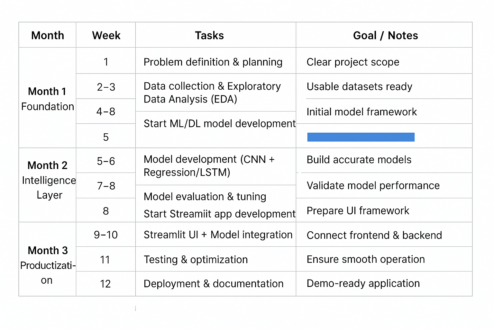

## Successfull push to Github

(1) checking type and linting errors         
-- Before committing, run these commands to check for type and check errors     
-- tox -e lint   
-- tox -e type   
-- tox -e format   
(2) tests files can be later included to add unittest (optional)            
-- when unittest files are added, use the following commands before committing    
-- tox -e py    
-- tox -e coverage   

## Project Folder Suggestions/hints

# Balcony Green Project Structure

[balcony-green](./)     
├── [pyproject.toml](./pyproject.toml)           <!-- Dependencies & project metadata -->   
├── [README.md](./README.md)                     <!-- Project overview & usage -->    
├── [.gitignore](./.gitignore)     
├── [src](./src)/    
│   └── [balcony_green](./src/balcony_green/)           <!-- Main Python package -->     
│       ├── [__init__.py](./src/balcony_green/__init__.py)     
│       ├── [app.py](./src/balcony_green/app.py)           <!-- Streamlit entry point -->     
│       ├── [pages](./src/balcony_green/pages/)        <!-- Streamlit multi-page app -->     
│       │   ├── [__init__.py](./src/balcony_green/pages/__init__.py)       
│       │   ├── [home.py](./src/balcony_green/pages/home.py)       
│       │   ├── [plant_health.py](./src/balcony_green/pages/plant_health.py)      
│       │   ├── [growth_prediction.py](./src/balcony_green/pages/growth_prediction.py)    
│       │   └── [analytics.py](./src/balcony_green/pages/analytics.py)       
│       ├── [models](./src/balcony_green/models/)           <!-- Trained ML / DL models -->    
│       │   ├── [disease_model.h5](./src/balcony_green/models/disease_model.h5)       
│       │   └── [growth_model.pkl](./src/balcony_green/models/growth_model.pkl)      
│       ├── [utils](./src/balcony_green/utils/)              <!-- Core logic & helpers -->    
│       │   ├── [__init__.py](./src/balcony_green/utils/__init__.py)       
│       │   ├── [predictor.py](./src/balcony_green/utils/predictor.py)          <!-- Model inference -->   
│       │   ├── [recommender.py](./src/balcony_green/utils/recommender.py)      <!-- Plant recommendations -->    
│       │   └── [preprocessing.py](./src/balcony_green/utils/preprocessing.py)     
│       ├── [data](./src/balcony_green/data/)            <!-- App-level datasets -->    
│       │   ├── [plant_data.csv](./src/balcony_green/data/plant_data.csv)      
│       │   └── [environment_data.csv](./src/balcony_green/data/environment_data.csv)     
│       ├── [config](./src/balcony_green/config/)          <!-- Configuration -->    
│       │   ├── [__init__.py](./src/balcony_green/config/__init__.py)      
│       │   └── [settings.py](./src/balcony_green/config/settings.py)     
│       └── [assets](./src/balcony_green/assets/)          <!-- Images, icons, logos -->    
│           └── [logo.png](./src/balcony_green/assets/logo.png)    
├── [notebooks](./notebooks/)               <!-- EDA & model training -->    
│   ├── [data_exploration.ipynb](./notebooks/data_exploration.ipynb)      
│   └── [model_training.ipynb](./notebooks/model_training.ipynb)       
├── [tests](./tests/)                    <!-- (Optional but professional) -->    
│   ├── [__init__.py](./tests/__init__.py)       
│   └── [test_predictor.py](./tests/test_predictor.py)      
└── [docs](./docs/)                    <!-- (Optional) -->    
    └── [architecture.md](./docs/architecture.md)    

## A Rough Roadmap  

## Datasets:
Disease Detection Model:
https://www.kaggle.com/datasets/abdallahalidev/plantvillage-dataset
