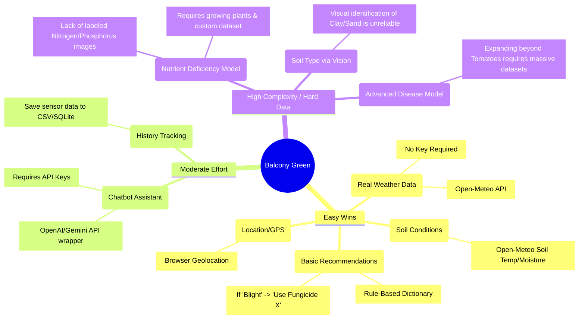

# Current Project Status

**Date:** January 24, 2026
**Active Branch:** `model-making` (Recommended for development)

## 1. Overall Project Progress
The project currently has a working localized disease detection application using `Streamlit` and PyTorch (`EfficientNet`).
- **Functionality**:
    - Live stream Simulation (random data).
    - Image classification for tomato diseases (11 classes) and Binary classification (Healthy/Disease).
    - External Camera integration stub.
- **Codebase**:
    - Main logic in `src/balconygreen/`.
    - Models in `disease-detection/Tomatoes/Models/`.
    - **Missing**: Unit tests (`tests/` folder), incomplete `pyproject.toml` dependencies.

## 2. Updated Project Roadmap & Architecture

This section visualizes the initial ideas, current status, and a feasibility-based path forward.

### Feature Feasibility Mind Map
Values are categorized by **Ease of Implementation** vs **Data Availability**.



### Proposed Architecture Diagram
Solid lines = Existing. Dotted lines = Easy Additions.

```mermaid
block-beta
  columns 3
  
  block:Frontend
    StreamlitApp["Streamlit UI\n(app.py)"]
    GeoLoc[("GPS Module\n(Future)")]
  end

  block:CoreLogic
    ImageInput[("Image Input")]
    StreamController["Stream Controller"]
    SensorReader["Sensor Reader"]
    RecSys["Recommendation Engine\n(Future: Rule-Based)"]
    WeatherMod["Weather Client\n(Future: Open-Meteo)"]
  end

  block:Data_AI
    Inference["Disease Inference"]
    Models[("PyTorch Models")]
    ExtAPIs[("Open-Meteo API")]
    KnowledgeBase[("Remedies.json")]
  end

  StreamlitApp --> StreamController
  StreamlitApp --> ImageInput
  StreamlitApp --> SensorReader
  StreamlitApp --> GeoLoc
  
  ImageInput --> Inference
  Inference --> Models
  
  SensorReader -.-> WeatherMod
  WeatherMod -.-> ExtAPIs
  
  Inference -.-> RecSys
  RecSys -.-> KnowledgeBase
  RecSys -.-> StreamlitApp
```



## 3. How to Test and Run

### Prerequisites
- Python 3.10+
- Git

### Setup Steps (Active Branch)
1.  **Clone the Repository**:
    ```bash
    git clone https://github.com/Sarupsr11/Balcony-Green.git
    cd Balcony-Green
    git checkout model-making
    ```

2.  **Install Dependencies**:
    The `pyproject.toml` is currently missing some ML dependencies. Install them manually:
    ```bash
    pip install -e .
    pip install torch torchvision timm pillow
    ```

3.  **Run the Application**:
    ```bash
    streamlit run src/balconygreen/app.py
    ```

### Manual Testing
- **Disease Detection**:
    1. Click "Upload Image" or "External Camera Sensor".
    2. Upload a tomato leaf image.
    3. Verify the "Health Prediction" outputs a class name (e.g., "Tomato___Early_blight") and confidence score.
- **Sensor Stream**:
    1. Click "Start Stream".
    2. Verify that mock temperature/humidity data updates every second.

## 5. Detailed Implementation Plans

### A. Real Weather & Soil Data Integration (Priority: High)
**Goal:** Replace random mock data with real-time conditions.
- **Data Source:** [Open-Meteo API](https://open-meteo.com/en/docs) (Free, No Key required).
- **Data Points:** Temperature, Humidity, Rain, **Soil Moisture (0-1cm)**.
- **Step-by-Step Implementation:**
    1.  **Create Service File:** `src/balconygreen/weather_service.py`
    2.  **API Call Logic:**
        ```python
        import requests
        def get_local_weather(lat, lon):
            url = "https://api.open-meteo.com/v1/forecast"
            params = {
                "latitude": lat,
                "longitude": lon,
                "current": "temperature_2m,relative_humidity_2m,rain,soil_moisture_0_to_1cm"
            }
            try:
                response = requests.get(url, params=params, timeout=5)
                return response.json().get('current', {})
            except:
                return None
        ```
    3.  **Update `app.py`:** Replace `SensorReader.read()` with a call to `get_local_weather`.

### B. Location/GPS Integration (Priority: Medium)
**Goal:** Automatically get `lat` and `lon` for the weather service.
- **Library:** `streamlit-js-eval` (Wrapper for HTML5 Geolocation).
- **Step-by-Step Implementation:**
    1.  **Install:** `pip install streamlit-js-eval`
    2.  **Frontend Code (`app.py`):**
        ```python
        from streamlit_js_eval import get_geolocation
        loc = get_geolocation()
        if loc:
            lat, lon = loc['coords']['latitude'], loc['coords']['longitude']
        else:
            lat, lon = 51.5, -0.09 # Default fallback/Manual Input
        ```

### C. Basic Recommendation System (Priority: Medium)
**Goal:** Suggest treatments based on the predicted disease class.
- **Data Source:** Agricultural extension websites (e.g., PlantVillage guides).
- **Implementation Strategy (Rule-Based):**
    1.  **Create Dictionary (`src/balconygreen/remedies.py`):**
        ```python
        REMEDIES = {
            "Tomato___Early_blight": {
                "description": "Fungal infection causing bullseye spots.",
                "treatment": "Remove infected leaves immediately. Apply copper-based fungicide.",
                "prevention": "Mulch soil to prevent splash-back."
            },
            "Tomato___Healthy": {
                 "description": "Plant looks good!",
                 "treatment": "Continue regular watering and monitoring.",
                 "prevention": "N/A"
            }
            # Add entries for all 11 model classes
        }
        ```
    2.  **Integrate in `app.py`:**
        ```python
        # After prediction
        result_class = results_1[0]['class_name']
        if result_class in REMEDIES:
            info = REMEDIES[result_class]
            st.info(f"**Treatment:** {info['treatment']}")
        ```

### D. Chatbot Assistant (Priority: Future)
**Goal:** Allow users to ask free-form questions like "Why are my leaves yellow?".
- **API Options:**
    - **OpenAI (Paid):** Easy to use, high quality.
    - **Google Gemini (Free Tier):** Generous free limits for prototyping.
- **Step-by-Step:**
    1.  **Get API Key** from provider.
    2.  **Install SDK:** `pip install google-generativeai`
    3.  **Frontend (`app.py`):**
        ```python
        import google.generativeai as genai
        user_query = st.chat_input("Ask the Plant Doctor...")
        if user_query:
            # Construct prompt with current disease prediction context
            context = f"The user's plant is diagnosed with {current_disease}."
            response = model.generate_content(context + user_query)
            st.write(response.text)
        ```

### E. Nutrient Deficiency Model (Priority: Low / Research)
**Why Low Priority?** Extremely hard to find clean, labeled image data for specific nutrient deficiencies (N-P-K) vs. general "yellowing".
- **Strategy:** Instead of a visual model, use a **Logic-Based** approach in the Recommendation System.
    - *If Plant is Healthy AND Soil Moisture is Good AND Growth is Slow -> Suggest Nitrogen Test.*

## 6. Known Issues & Todos
- **Dependencies:** `pyproject.toml` needs `torch`, `timm`, `pillow` added.
- **Tests:** `tests/` folder is missing. `tox -e lint` might fail due to missing dependencies.
- **Data:** `plant_data.csv` mentioned in documents is missing in this branch.
